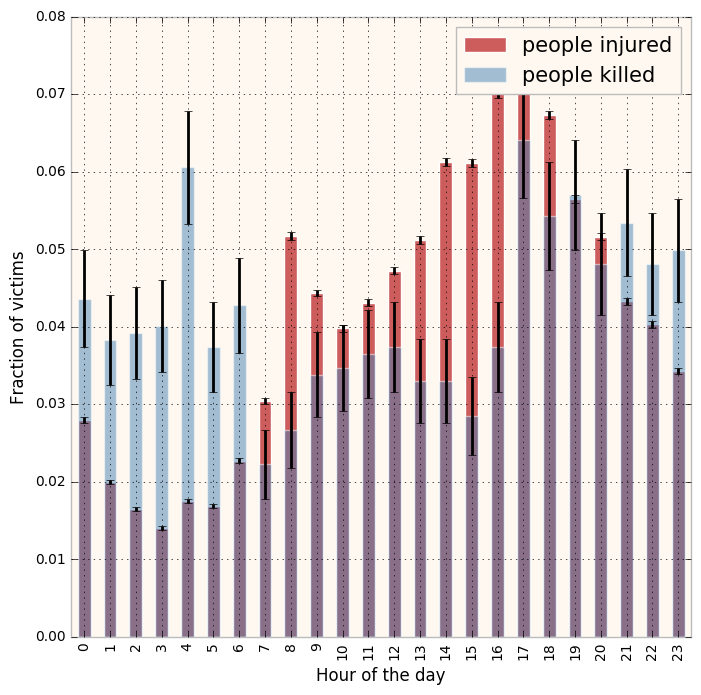

It is interseting topic for analysis. The dataset, data processing and analysis is clear and understandable. 

The plot includes error and the data is normalized, thus making it easy to compare and interept across the categories. 

My suggestion would be a rectanglular figure would be visually more inferential than the square plot. 
One more little addition would be swaping the colors of _people injured_ with _people killed_ i.e have red color for _people killed_ as visually red color is more intuitively better for example - danger or a stop sign.

The Legend - could be put into the center so as to not overlap the plot itself. 

There is another addition that can be done to better the plot that you have expressed - there is no title for the plot
If the title was added the whole idea of the plot would have been way more intuitive

