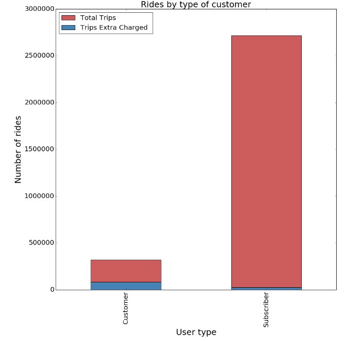
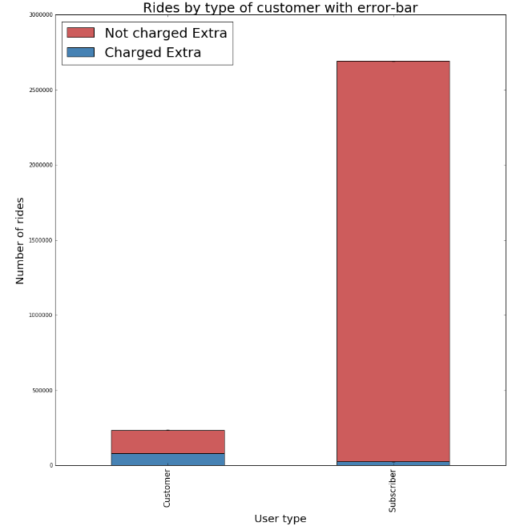
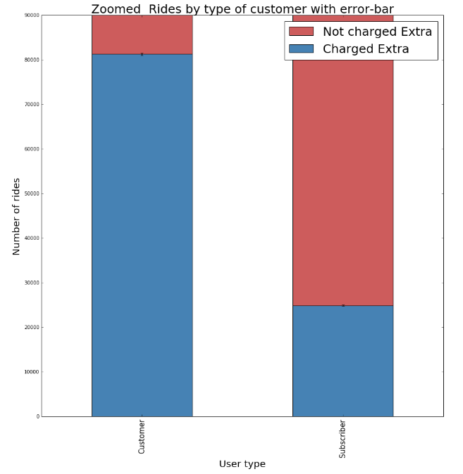
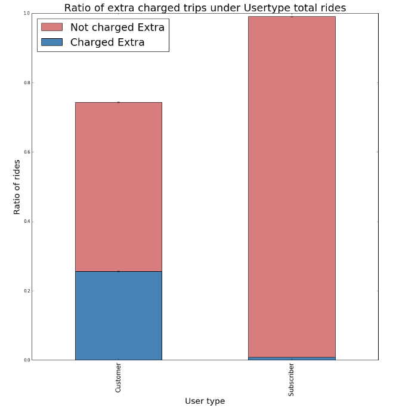
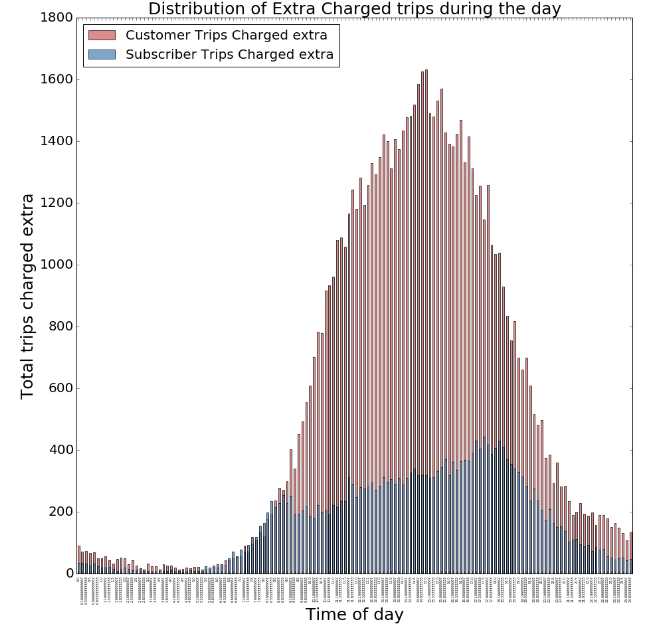
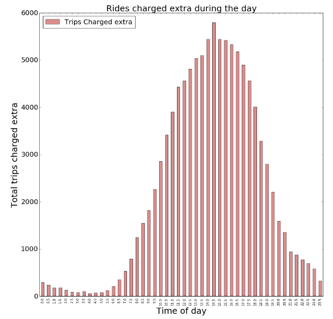
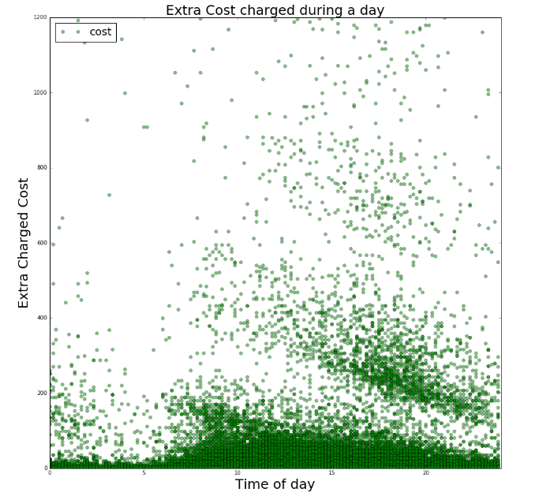
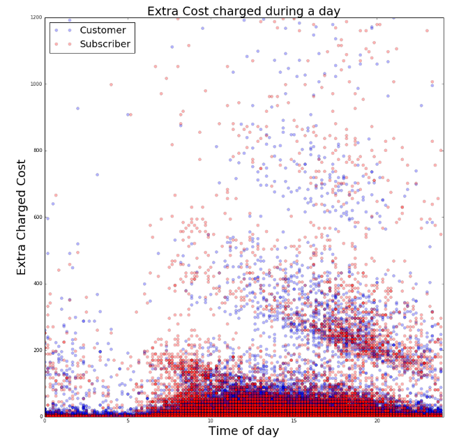
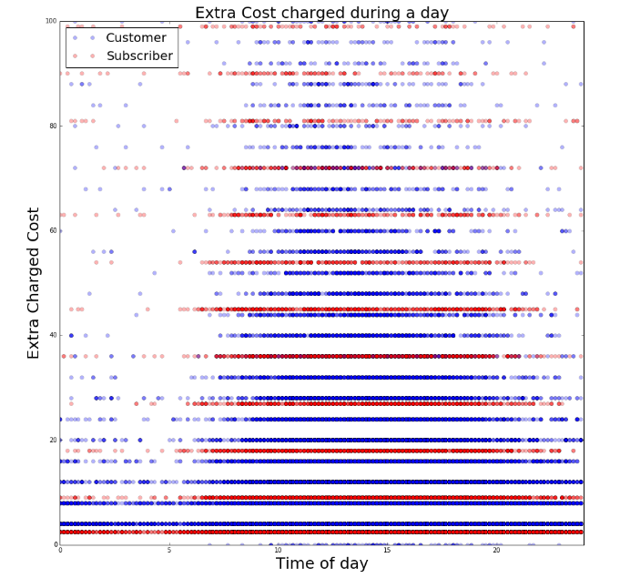
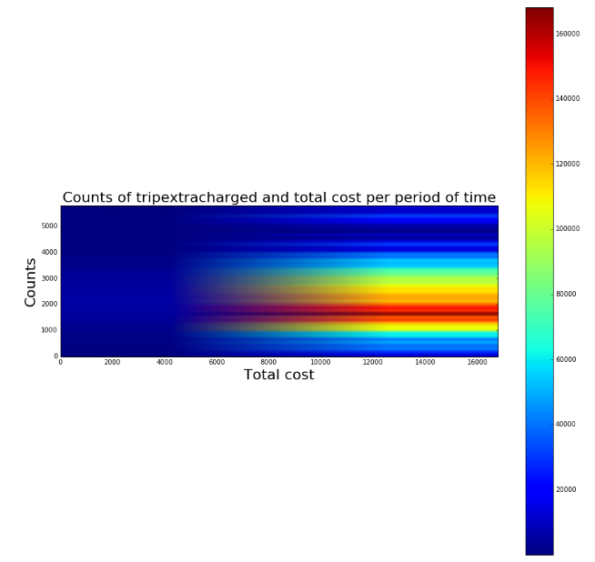

The first 4 graphs are consistent with the hypothesis about the user's willingness to pay extra charge for city bike for subcribers and users. Since the error bar is too small and cannot be seen on the second graph, the second graph can be eliminated since it doesn't provide any new information.

Figure 1:

Figure 2:

Figure 3:

Figure 4:

The fifth graph show the count of extra charged trips by hour. However, since there is a lot of values on the x-axis, the characters are very small and unclear. This graph should be omitted and replaced with the sixth graph, in which the x-values are redefined.

Figure 5:

Figure 6:

The seventh and eighth graphs can be combined since they provide the same information. They all show the distribution of extra charged costs over the hours but it is hard to detect a pattern here.

Figure 7:

Figure 8:

The ninth graph is a zoom-in version of the eigth graph. The pattern is not very clear in this graph.

Figure 9:

The tenth graph lack a description of the third dimension, which is the color band.

Figure 10:

Overall, you did a really nice job with the hypothesis, test conduction and analysis. The first 4 graphs illustrate your work well. The other graphs serves as addition information and are interesting to look at.